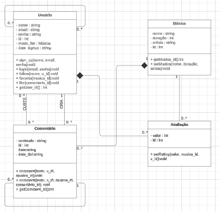
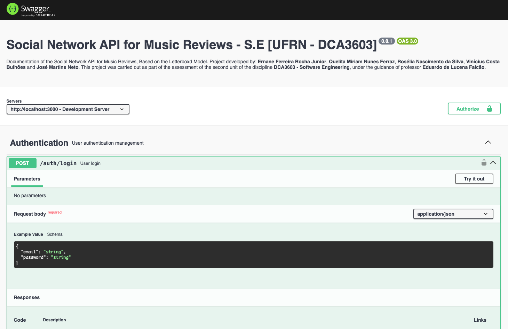

# Social Network API for Music Reviews

[](https://github.com/ErnaneJ/sn-music-review-api/actions/workflows/ci.yml)

A **Music API** é uma aplicação backend desenvolvida para gerenciar músicas, usuários, avaliações, favoritos, comentários e interações entre usuários no contexto de uma plataforma musical. A API permite que os usuários registrem músicas favoritas, escrevam e leiam reviews, comentem nas músicas e interajam com outros usuários. A aplicação foi desenvolvida com **Node.js**, utilizando **Express.js** e **Prisma ORM** com **SQLite** para gerenciamento de banco de dados.

**Componentes do grupo:** 

- JOSE MARTINS NETO

- QUELITA MIRIAM NUNES FERRAZ

- ERNANE FERREIRA ROCHA JUNIOR

- ROSELIA NASCIMENTO DA SILVA

- VINÍCIUS COSTA BULHÕES

## Histórias de Usuário

O projeto tem como objetivo criar uma rede social de reviews de músicas, onde usuários podem interagir entre si, avaliar músicas, deixar comentários e organizar suas favoritas. As histórias de usuário abaixo representam as principais funcionalidades desejadas para a aplicação, priorizando a experiência do usuário e o objetivo central do sistema.

1. Cadastrar usuário<br>Como usuário, quero me cadastrar com email e senha para acessar a plataforma.<br><br>Critério de aceitação:<br>  - O sistema deve notifica caso email já está em uso;
2. Favoritar músicas<br>Como usuário, quero salvar músicas como “favoritas” para encontrá-las facilmente e ver suas avaliações.<br><br>Critério de aceitação:<br>  - Um usuário deve ser capaz de remover uma música dos favoritos;<br>  - O sistema deve ser capaz de listar as músicas favoritas de um usuário;
3. Avaliar músicas<br>Como usuário, quero avaliar músicas com notas e comentários para compartilhar minhas opniões.<br><br>Critério de aceitação:<br>  - As avaliações devem ser um número entre 1 e 5;<br>  - Um comentário pode ser feito tanto a uma música quanto a um outro comentário;
4. Seguir usuários<br>Como usuário, quero seguir outros usuários para poder acompanhar suas atividades.<br><br>Critério de aceitação:<br>  - O usuário não deve poder seguir a si mesmo;<br>  - O usuário deve poder desseguir outro usuário;<br>  - O sistema deve ser capaz de listar tanto os seguidores quanto quem o usuário segue;
5. Buscar por músicas<br>Como usuário, quero poder buscar músicas para poder encontrar rapidamente aquelas que me interessam.<br><br>Critério de aceitação:<br>  - O sistema deve ser capaz de realizar buscas de músicas pelo: título, artista, álbum ou gênero;

## Diagrama UML

O diagarama de classe UML abaixo descreve a estrutura desenvolvida para a apliacação do projeto.

|Diagrama UML|
|-------------|
||

## Tecnologias Utilizadas

- **Node.js** com JavaScript puro.
- **Express.js** para criação das rotas e servidor.
- **Prisma ORM** para interagir com o banco de dados.
- **SQLite** como banco de dados relacional.
- **Docker** para containerização da aplicação.
- **JWT (JSON Web Token)** para autenticação de usuários.

## Tabela de Rotas

### **Authentication**  

Operações relacionadas à autenticação de usuários.

| Método | Rota            | Descrição                           | Parâmetros / Corpo                          | Resposta                           | Autenticação |
|--------|-----------------|-------------------------------------|---------------------------------------------|-----------------------------------|--------------|
| `POST` | `/auth/login`    | Realiza o login do usuário e gera um token JWT. | `email`, `password`                         | `{ token: "jwt_token" }`          | ❌            |

### **Comments**  

Operações relacionadas a comentários.

| Método | Rota                        | Descrição                                                | Parâmetros / Corpo                              | Resposta                            | Autenticação |
|--------|-----------------------------|----------------------------------------------------------|-------------------------------------------------|------------------------------------|--------------|
| `POST` | `/comments`                 | Cria um novo comentário em uma música ou avaliação.       | `content`, `userId`, `songId` ou `reviewId`     | `{ id, content, userId, createdAt, updatedAt }` | ✅            |
| `GET`  | `/comments/{reviewId}`      | Recupera todos os comentários para uma avaliação específica. | `reviewId`                                      | `[ { id, content, userId, createdAt, updatedAt } ]` | ❌            |
| `PUT`  | `/comments/{id}`            | Atualiza um comentário existente.                         | `id`, `content`                                 | `{ id, content, updatedAt }`       | ✅            |
| `DELETE`| `/comments/{id}`           | Deleta um comentário existente.                          | `id`                                           | `{ message: "Comentário deletado" }` | ✅            |

### **Likes**  

Operações relacionadas a curtidas.

| Método  | Rota                        | Descrição                                                | Parâmetros / Corpo                              | Resposta                            | Autenticação |
|---------|-----------------------------|----------------------------------------------------------|-------------------------------------------------|------------------------------------|--------------|
| `POST`  | `/likes`                     | Adiciona uma curtida a uma avaliação.                    | `reviewId`, `userId`                            | `{ message: "Curtir adicionado" }` | ✅            |
| `DELETE`| `/likes`                     | Remove uma curtida de uma avaliação.                     | `reviewId`, `userId`                            | `{ message: "Curtir removido" }`   | ✅            |
| `GET`   | `/likes/{reviewId}`          | Recupera todas as curtidas de uma avaliação.             | `reviewId`                                      | `[ { id, userId, reviewId } ]`     | ❌            |

### **Reviews**

Operações relacionadas a avaliações.

| Método  | Rota                         | Descrição                                                | Parâmetros / Corpo                              | Resposta                             | Autenticação |
|---------|------------------------------|----------------------------------------------------------|-------------------------------------------------|-------------------------------------|--------------|
| `POST`  | `/reviews`                   | Cria uma nova avaliação para uma música.                 | `songId`, `rating`, `content`                   | `{ id, userId, songId, rating, content }` | ✅            |
| `PATCH` | `/reviews/{reviewId}`        | Atualiza uma avaliação existente.                        | `reviewId`, `rating`, `content`                 | `{ id, userId, songId, rating, content, updatedAt }` | ✅            |
| `DELETE`| `/reviews/{reviewId}`        | Deleta uma avaliação existente.                          | `reviewId`                                      | `{ message: "Avaliação deletada" }`  | ✅            |
| `GET`   | `/reviews/song/{songId}`     | Lista todas as avaliações de uma música.                 | `songId`                                        | `[ { id, userId, songId, rating, content } ]` | ❌            |

### **Users**  

Operações relacionadas aos usuários.

| Método  | Rota                         | Descrição                                                | Parâmetros / Corpo                              | Resposta                             | Autenticação |
|---------|------------------------------|----------------------------------------------------------|-------------------------------------------------|-------------------------------------|--------------|
| `POST`  | `/users`                     | Cria um novo usuário na plataforma.                      | `email`, `password`                             | `{ id, email, createdAt, updatedAt }` | ❌            |
| `POST`  | `/users/follow`              | Segue um usuário.                                        | `userIdToFollow`                                | `{ followerId }`                      | ✅            |
| `POST`  | `/users/unfollow`            | Dessegue um usuário.                                     | `userIdToUnfollow`                              | `{ followerId }`                      | ✅            |
| `GET`   | `/users/{userId}/followers`  | Lista todos os usuários que um usuário segue             | `userId`                                        | `[ { followerId, follower } ]`        | ✅            |
| `GET`   | `/users/{userId}/following`  | Lista todos os seguidores de um usuário                  | `userId`                                        | `[ { followingId, following } ]`      | ✅            |
| `GET`   | `/users`                     | Lista todos os usuários registrados.                     | Nenhum                                          | `[ { id, email, createdAt, updatedAt } ]` | ✅            |
| `GET`   | `/users/{userId}`            | Obtém detalhes de um usuário específico.                 | `userId`                                        | `{ id, email, createdAt, updatedAt }` | ✅            |
| `PATCH` | `/users/{userId}`            | Atualiza os dados de um usuário específico.              | `userId`, `email`, `password`                   | `{ id, email, updatedAt }`          | ✅            |

## Songs

Operações relacionadas a músicas

| Método | Rota               | Descrição                                | Autenticação |
|--------|---------------------|------------------------------------------|---------------------|
| `POST`   | `/songs`              | Criar uma nova música                   | ✅                |
| `POST`   | `/songs/{songId}/favorite` | Adiciona uma música aos favoritos  | ✅                |
| `GET`    | `/songs`              | Listar todas as músicas                 | ❌              |
| `PATCH`  | `/songs/{songId}`     | Atualizar uma música                    | ✅               |
| `DELETE` | `/songs/{songId}/favorite` | Remove uma música dos favoritos    | ✅               |
| `DELETE` | `/songs/{songId}`     | Deletar uma música                      | ✅              |
| `GET`    | `/songs/{songId}`     | Obter detalhes de uma música            | ❌             |
| `GET`    | `/songs/search`       | Buscar músicas por título, artista, álbum ou gênero | ❌              |
| `GET`    | `/songs/favorites`    | Lista todos as músicas favoritas do usuário | ✅ |

## Como Levantar a Aplicação

### Passo 1: Copiar o Arquivo `.env`

Primeiro, copie o arquivo `.env.example` para `.env`:

```bash
cp .env.example .env
```

Isso criará o arquivo de configuração para as variáveis de ambiente.

### Passo 2: Subir os Containers com Docker

Em seguida, execute o comando abaixo para levantar a aplicação utilizando **Docker Compose**:

```bash
docker-compose up --build
```

Isso irá construir e iniciar o container do servidor.

### Passo 3: Acessar o Servidor e o Prisma Studio

- O servidor estará acessível em `http://localhost:3000`.
- O **Prisma Studio** estará acessível em `http://localhost:5555`.

Para acessar a documentação swagger acesse: `http://localhost:3000/api-docs`

### Passo 4: Rodar o Seed para Popular o Banco com Dados

Se quiser popular o banco com dados de exemplo, execute o comando abaixo para rodar o seed:

```bash
docker exec music-api-server-1 sh -c "npm run db:seed"
```

Lembre-se de que `music-api-server-1` é o nome do container. Caso o nome seja diferente, execute o comando `docker ps -a` ou verifique na interface gráfica do Docker para descobrir o nome exato do container.

### Passo 5: Limpar o Banco de Dados

Caso queira limpar o banco de dados, execute o comando abaixo:

```bash
npx prisma migrate reset
```

Este comando remove todos os dados das tabelas e recria o banco de dados a partir do esquema definido no `prisma/schema.prisma`.

### Usando Swagger para rotas autenticadas



Siga estas etapas para usar rotas autenticadas no Swagger:

1. **Acesse o Swagger**  
   Abra o Swagger em [http://localhost:3000/api-docs](http://localhost:3000/api-docs).

2. **Crie um usuário**  
   - Navegue até a seção **Usuários**.  
   - Localize a rota `POST /users` (Criar).  
   - Expanda a seção, clique em **Experimente** e edite a carga JSON com o e-mail e a senha desejados. Por exemplo:  
     ```json
     {
       "email": "seu_email@exemplo.com",
       "senha": "sua_senha"
     }
     ```  
   - Clique em **Executar** para criar o usuário.

3. **Faça login com o usuário**  
   - Navegue até a seção **Autenticação**.  
   - Localize a rota `POST /auth/login`.  
   - Expanda a seção, clique em **Experimente** e forneça o e-mail e a senha que você usou para criar o usuário.  
   - Clique em **Executar** para fazer login.  

4. **Copie o token**  
   - A resposta de login incluirá um token. Por exemplo:  
     ```json
     {
       "token": "SEU_TOKEN_AQUI"
     }
     ```  
   - Copie o valor de `"YOUR_TOKEN_HERE"`.

5. **Autorizar em Swagger**  
   - Role até o topo da página do Swagger.  
   - Clique no botão **Autorizar** no canto superior direito.  
   - Cole o token copiado no campo que aparece.  
   - Clique em **Autorizar** para confirmar.

6. **Você está autenticado**  
   Uma vez autorizado, agora você pode acessar todas as rotas autenticadas no Swagger sem etapas adicionais!

## Interagindo com a API

Depois de levantar a aplicação, você pode interagir com a API usando `curl`.

### Criar um Usuário

```bash
curl -X POST http://localhost:3000/users \
  -H "Content-Type: application/json" \
  -d '{"email": "seu_email@exemplo.com", "senha": "sua_senha"}'
```

### Fazer Login e Obter o Token

```bash
curl -X POST http://localhost:3000/auth/login \
  -H "Content-Type: application/json" \
  -d '{"email": "seu_email@exemplo.com", "senha": "sua_senha"}'
```

A resposta incluirá algo como:

```json
{
  "token": "SEU_TOKEN_AQUI"
}
```

### Usar o Token para Rotas Autenticadas

Substitua `SEU_TOKEN_AQUI` pelo token retornado no login para autenticar nas próximas requisições.

#### Exemplo: Listar Músicas

```bash
curl -X GET http://localhost:3000/musics \
  -H "Authorization: Bearer SEU_TOKEN_AQUI"
```

### Criar uma Música

```bash
curl -X POST http://localhost:3000/musics \
  -H "Content-Type: application/json" \
  -H "Authorization: Bearer SEU_TOKEN_AQUI" \
  -d '{"nome": "Nova Música", "artista": "Artista Famoso", "genero": "Pop"}'
```

## Testest (JEST)

```bash
   npm test
```

Ou verifique o workflow clicando [aqui](https://github.com/ErnaneJ/sn-music-review-api/actions/workflows/ci.yml).
